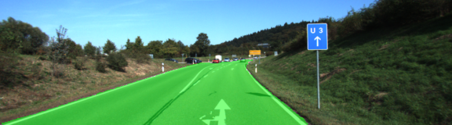
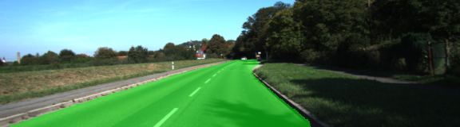
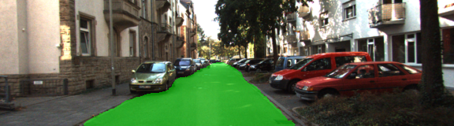

# **Semantic Segmentation Project** 

## Built by Dmitry Zaganich in March 2018.



## Writeup 

---

**The Goal of this Project**

In this project, I use what I've learned about Fully Convolutional Network (FCN) to label the pixels of a road in images from [Kitti Road dataset](http://www.cvlibs.net/datasets/kitti/eval_road.php).

## Rubric Points
### Here I will consider the [rubric points](https://review.udacity.com/#!/rubrics/989/view) individually and describe how I addressed each point in my implementation.  

---
### Project files

To meet rudric points, the project contains these files: 
* main.py. This file contains FCN implementation based on the VGG-16, provided by the Udacity. It also covers network training and video processing.
* helper.py. This file is required to download the dataset and prepare batches of it to feed them into neural network. I also added augmentation to the data set loading.
* project_tests.py. This file checks implementation of FCN in main.py and it was provided by Udacity.

The directory runs/ contains results on the test image set. The directory videos/ contains a video from the very first project of CarND program and it's processed by the neural network version. 

### Setup
##### Frameworks and Packages
Make sure you have the following is installed:
 - [Python 3](https://www.python.org/)
 - [TensorFlow](https://www.tensorflow.org/)
 - [NumPy](http://www.numpy.org/)
 - [SciPy](https://www.scipy.org/)
##### Dataset
Download the [Kitti Road dataset](http://www.cvlibs.net/datasets/kitti/eval_road.php) from [here](http://www.cvlibs.net/download.php?file=data_road.zip).  Extract the dataset in the `data` folder.  This will create the folder `data_road` with all the training a test images.

### Build the Neural Network

#### 1. Does the project load the pretrained vgg model?

The function has a pretty straight forward implementation, which is:

```

def load_vgg(sess, vgg_path):
    """
    Load Pretrained VGG Model into TensorFlow.
    :param sess: TensorFlow Session
    :param vgg_path: Path to vgg folder, containing "variables/" and "saved_model.pb"
    :return: Tuple of Tensors from VGG model (image_input, keep_prob, layer3_out, layer4_out, layer7_out)
    """
    vgg_tag = 'vgg16'
    vgg_input_tensor_name = 'image_input:0'
    vgg_keep_prob_tensor_name = 'keep_prob:0'
    vgg_layer3_out_tensor_name = 'layer3_out:0'
    vgg_layer4_out_tensor_name = 'layer4_out:0'
    vgg_layer7_out_tensor_name = 'layer7_out:0'

    tf.saved_model.loader.load(sess, [vgg_tag], vgg_path)

    vgg_input = tf.get_default_graph().get_tensor_by_name(vgg_input_tensor_name)
    vgg_keep_prob = tf.get_default_graph().get_tensor_by_name(vgg_keep_prob_tensor_name)
    vgg_layer3 = tf.get_default_graph().get_tensor_by_name(vgg_layer3_out_tensor_name)
    vgg_layer4 = tf.get_default_graph().get_tensor_by_name(vgg_layer4_out_tensor_name)
    vgg_layer7 = tf.get_default_graph().get_tensor_by_name(vgg_layer7_out_tensor_name)

    return vgg_input, vgg_keep_prob, vgg_layer3, vgg_layer4, vgg_layer7

```

#### 2. Does the project learn the correct features from the images?

In this project I was forced to use a set number of skip connections, to layers 4 and 3 of VGG-16. I decided to use neural network structure which was described in the lesson 10: Scene Understanding, FCN-8 - Decoder. I've split last upsampling layer into two, to create smoother transition than x8, which was in the lesson. I also print the resolution of the last layer to ensure that I get the same resolution as original images.

```

def layers(vgg_layer3_out, vgg_layer4_out, vgg_layer7_out, num_classes, sess=None, vgg_input=None, keep_prob=None):
    """
    Create the layers for a fully convolutional network.  Build skip-layers using the vgg layers.
    :param vgg_layer3_out: TF Tensor for VGG Layer 3 output
    :param vgg_layer4_out: TF Tensor for VGG Layer 4 output
    :param vgg_layer7_out: TF Tensor for VGG Layer 7 output
    :param num_classes: Number of classes to classify
    :return: The Tensor for the last layer of output
    """

    # based on the lesson 10: Scene Understanding, FCN-8 - Decoder

    stddev = 0.01
    reg = 1e-3

    # 1x1 convolution to the layer 7 of VGG-16. Output 5 18
    layer7_1x1 = tf.layers.conv2d(vgg_layer7_out, num_classes,
                                  kernel_size=1,
                                  strides=1,
                                  padding='same',
                                  kernel_initializer=tf.random_normal_initializer(stddev=stddev),
                                  kernel_regularizer=tf.contrib.layers.l2_regularizer(reg))

    # 1x1 convolution to the layer 4 of VGG-16. Output 10 36
    layer4_1x1 = tf.layers.conv2d(vgg_layer4_out, num_classes,
                                  kernel_size=1,
                                  strides=1,
                                  padding='same',
                                  kernel_initializer=tf.random_normal_initializer(stddev=stddev),
                                  kernel_regularizer=tf.contrib.layers.l2_regularizer(reg))

    # 1x1 convolution to the layer 3 of VGG-16. Output 20 72
    layer3_1x1 = tf.layers.conv2d(vgg_layer3_out, num_classes,
                                  kernel_size=1,
                                  strides=1,
                                  padding='same',
                                  kernel_initializer=tf.random_normal_initializer(stddev=stddev),
                                  kernel_regularizer=tf.contrib.layers.l2_regularizer(reg))

    # Apply decoder and upsample output to 10 36
    layer7_decoder = tf.layers.conv2d_transpose(layer7_1x1, num_classes,
                                                kernel_size=4,
                                                strides=2,
                                                padding='same',
                                                kernel_initializer=tf.random_normal_initializer(stddev=stddev),
                                                kernel_regularizer=tf.contrib.layers.l2_regularizer(reg))

    # Add skip connection to layer 4 of VGG. Output 10 36
    skip_connection_l7_decoder_l4_1x1 = tf.add(layer7_decoder, layer4_1x1)

    # Apply decoder and upsample output to 20 72
    layer4_decoder = tf.layers.conv2d_transpose(skip_connection_l7_decoder_l4_1x1, num_classes,
                                                kernel_size=4,
                                                strides=2,
                                                padding='same',
                                                kernel_initializer=tf.random_normal_initializer(stddev=stddev),
                                                kernel_regularizer=tf.contrib.layers.l2_regularizer(reg))

    # Add skip connection to layer 3 of VGG. Output 20 72
    skip_connection_l4_decoder_l3_1x1 = tf.add(layer4_decoder, layer3_1x1)

    # Apply decoder and upsample output to 160 576
    out_mid_layer = tf.layers.conv2d_transpose(skip_connection_l4_decoder_l3_1x1, num_classes,
                                               kernel_size=4,
                                               strides=2,
                                               padding='same',
                                               kernel_initializer=tf.random_normal_initializer(stddev=stddev),
                                               kernel_regularizer=tf.contrib.layers.l2_regularizer(reg))

    nn_last_layer = tf.layers.conv2d_transpose(out_mid_layer, num_classes,
                                               kernel_size=8,
                                               strides=4,
                                               padding='same',
                                               kernel_initializer=tf.random_normal_initializer(stddev=stddev),
                                               kernel_regularizer=tf.contrib.layers.l2_regularizer(reg))

    if sess is not None:
        img = np.random.rand(8, 160, 576, 3)
        prints = [
            tf.Print(nn_last_layer, [tf.shape(nn_last_layer), " ------------------- OUT LAYER -------------------"],
                     summarize=4)]
        sess.run(tf.global_variables_initializer())
        sess.run(prints, feed_dict={vgg_input: img, keep_prob: 1.0})

    return nn_last_layer

```
  
#### 3. Does the project optimize the neural network?

I decided to use the loss suggested in lesson 10: Scene Understanding, FCN-8 - Classification & Loss. As for an optimizer, I went with AdamOptimizer, which is commonly used as the best common-purpose solution in the CarND program. 

```
def optimize(nn_last_layer, correct_label, learning_rate, num_classes):
    """
    Build the TensorFLow loss and optimizer operations.
    :param nn_last_layer: TF Tensor of the last layer in the neural network
    :param correct_label: TF Placeholder for the correct label image
    :param learning_rate: TF Placeholder for the learning rate
    :param num_classes: Number of classes to classify
    :return: Tuple of (logits, train_op, cross_entropy_loss)
    """

    logits = tf.reshape(nn_last_layer, (-1, num_classes))
    labels = tf.reshape(correct_label, (-1, num_classes))

    cross_entropy_loss = tf.reduce_mean(tf.nn.softmax_cross_entropy_with_logits(logits=logits, labels=labels))
    adam_optimizer = tf.train.AdamOptimizer(learning_rate=learning_rate)
    train_op = adam_optimizer.minimize(cross_entropy_loss)

    return logits, train_op, cross_entropy_loss
```


#### 4. Does the project train the neural network?

The implementation of train function also does not contains any additional tricks and it's pretty straight forward.
I used dropout of 0.25% and learning rate of 0.00001 to ensure that model will came to a good result after a big amount of training epochs.

```
def train_nn(sess, epochs, batch_size, get_batches_fn, train_op, cross_entropy_loss, input_image,
             correct_label, keep_prob, learning_rate):
    """
    Train neural network and print out the loss during training.
    :param sess: TF Session
    :param epochs: Number of epochs
    :param batch_size: Batch size
    :param get_batches_fn: Function to get batches of training data.  Call using get_batches_fn(batch_size)
    :param train_op: TF Operation to train the neural network
    :param cross_entropy_loss: TF Tensor for the amount of loss
    :param input_image: TF Placeholder for input images
    :param correct_label: TF Placeholder for label images
    :param keep_prob: TF Placeholder for dropout keep probability
    :param learning_rate: TF Placeholder for learning rate
    """

    sess.run(tf.global_variables_initializer())

    for epoch in range(epochs):
        print("Epoch: %d" % epoch)

        total_loss = 0

        idx = 0

        for image, label in get_batches_fn(batch_size):
            _, loss = sess.run([train_op, cross_entropy_loss],
                               feed_dict={input_image: image, correct_label: label,
                                          keep_prob: 0.75, learning_rate: 0.00001})
            idx += 1
            total_loss += loss

        print("Average loss: %f" % (total_loss / idx))
```

# 


### Neural Network Training

#### 1. Does the project train the model correctly?

On average, the model decreases loss over time.

```

Epoch: 0
Average loss: 0.469507
Epoch: 1
Average loss: 0.180144
Epoch: 2
Average loss: 0.147139
Epoch: 3
Average loss: 0.127437
Epoch: 4
Average loss: 0.114835
Epoch: 5
Average loss: 0.104179
Epoch: 6
Average loss: 0.096762
Epoch: 7
Average loss: 0.088973
Epoch: 8
Average loss: 0.082514
Epoch: 9
Average loss: 0.081321
Epoch: 10
Average loss: 0.072361
Epoch: 11
Average loss: 0.071022
Epoch: 12
Average loss: 0.066802
Epoch: 13
Average loss: 0.064630
Epoch: 14
Average loss: 0.060540
Epoch: 15
Average loss: 0.059106
Epoch: 16
Average loss: 0.056178
Epoch: 17
Average loss: 0.054462
Epoch: 18
Average loss: 0.053128
Epoch: 19
Average loss: 0.055824
Epoch: 20
Average loss: 0.053582
Epoch: 21
Average loss: 0.051736
Epoch: 22
Average loss: 0.047080
Epoch: 23
Average loss: 0.045644
Epoch: 24
Average loss: 0.045173
Epoch: 25
Average loss: 0.044705
Epoch: 26
Average loss: 0.043162
Epoch: 27
Average loss: 0.041265
Epoch: 28
Average loss: 0.040718
Epoch: 29
Average loss: 0.046119
Epoch: 30
Average loss: 0.040188
Epoch: 31
Average loss: 0.039211
Epoch: 32
Average loss: 0.037494
Epoch: 33
Average loss: 0.040938
Epoch: 34
Average loss: 0.038777
Epoch: 35
Average loss: 0.035779
Epoch: 36
Average loss: 0.034736
Epoch: 37
Average loss: 0.034489
Epoch: 38
Average loss: 0.034243
Epoch: 39
Average loss: 0.035193
Epoch: 40
Average loss: 0.033403
Epoch: 41
Average loss: 0.032339
Epoch: 42
Average loss: 0.032522
Epoch: 43
Average loss: 0.032200
Epoch: 44
Average loss: 0.031021
Epoch: 45
Average loss: 0.032404
Epoch: 46
Average loss: 0.035763
Epoch: 47
Average loss: 0.030377
Epoch: 48
Average loss: 0.029711
Epoch: 49
Average loss: 0.028466

```

#### 2. Does the project use reasonable hyperparameters?

The initial dataset is very small, it contains only 289 images. Even after my "flip" augmentation, which is implemented in helper, it is still a very small dataset.

```
(augmentation code from helper.py, def get_batches_fn(batch_size) )

            for image_file in image_paths[batch_i:batch_i + batch_size]:
                gt_image_file = label_paths[os.path.basename(image_file)]

                image = scipy.misc.imresize(scipy.misc.imread(image_file), image_shape)
                gt_image = scipy.misc.imresize(scipy.misc.imread(gt_image_file), image_shape)

                gt_bg = np.all(gt_image == background_color, axis=2)
                gt_bg = gt_bg.reshape(*gt_bg.shape, 1)
                gt_image = np.concatenate((gt_bg, np.invert(gt_bg)), axis=2)

                images.append(image)
                gt_images.append(gt_image)

                # apply flip translation

                image_flipped = np.fliplr(image)
                gt_image_flipped = np.fliplr(gt_image)

                images.append(image_flipped)
                gt_images.append(gt_image_flipped)

            yield np.array(images), np.array(gt_images)

```

I used 50 epochs with batch of 1 image, which is turned into two (original and flipped versions), so the real batch size is two.

#### 3. Does the project correctly label the road?

The project does perform well on the test images. I also implemented video processing using the code from the first project of CarND and tested my code on it. The results are shown below:






Here's a [link to my video result](./videos/project_video_processed.mp4)

### Discussion

The project was a lot more easier than the previous Path Planning Project, but it was still quite a fun to discover what FCN networks are capable of.
I think, the result might be improved even further with contrast & brightness augmentation. 
The neural network also might be build over more complicated encoder structure than VGG-16, whih might help too. 

Still, even the current solution is able to demonstrate some useful results for road detection. 
